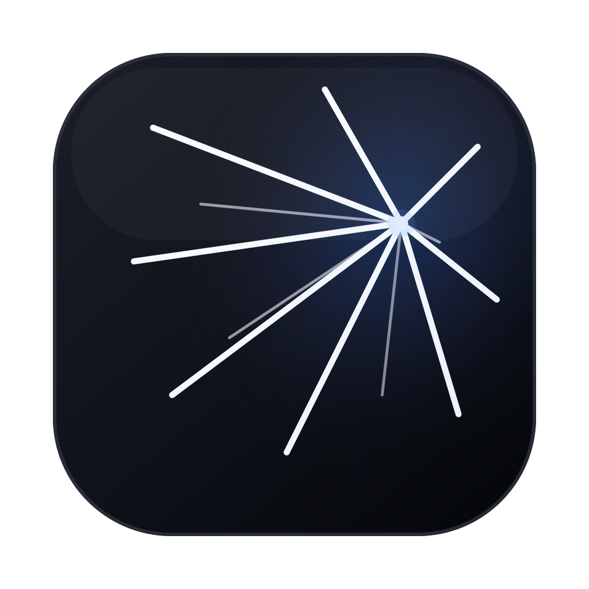

<div align="center">



# Anvil

**A local agent workbench for Claude Code-style workflows.**

Run, resume, approve, and replay AI coding sessions from a desktop UI. Anvil is
built on the official Claude Agent SDK and designed for local-first work,
Windows-friendly testing, and future spec-aware automation.

<br/>

[](#)
[](#alpha-install)
[](https://www.electronjs.org/)
[](https://docs.anthropic.com/)


<br/>

[**The Idea**](#the-idea) ·
[**Highlights**](#highlights) ·
[**What Works**](#what-works-today) ·
[**Roadmap**](#product-direction) ·
[**Install**](#alpha-install) ·
[**First Run**](#first-run) ·
[**Development**](#development)

</div>

---

> [!NOTE]
> Current version: `0.0.2` closed alpha. Windows builds include a manual update checker. Builds are not signed or notarized yet.

## The Idea

Anvil turns agent execution into a workbench.

Instead of treating an AI coding session as a terminal stream, Anvil gives it a
local UI surface:

<table>
<tr>
<td align="center" width="33%"><b>Conversations are persisted</b></td>
<td align="center" width="33%"><b>Tool calls are visible</b></td>
<td align="center" width="33%"><b>Approvals are explicit</b></td>
</tr>
<tr>
<td align="center"><b>Errors are readable</b></td>
<td align="center"><b>Sessions can be replayed</b></td>
<td align="center"><b>Settings live in one place</b></td>
</tr>
</table>

The long-term goal is a local, auditable, spec-aware environment for AI-assisted
work: workspace selection, file tree, diff review, project rules, browser tools,
and safer desktop automation.

---

## Highlights

| Capability | What it gives you |
| :--- | :--- |
| **Local sessions** | Every Anvil session is stored locally in SQLite. |
| **Readable streams** | Assistant output renders as Markdown, not raw events. |
| **Approvals** | Tool permission requests show up as explicit UI decisions. |
| **Queue next** | Draft the next prompt while the current turn is running. |
| **Resume workflow** | Continue from the selected Anvil session. |
| **Windows alpha** | Native Windows artifacts are built on GitHub Actions. |
| **Manual updater** | Windows packaged builds can check GitHub Releases for newer versions. |

---

## What Works Today

<table>
<tr>
<th align="left" width="33%">Desktop shell</th>
<th align="left" width="33%">Session layer</th>
<th align="left" width="33%">Conversation UX</th>
</tr>
<tr>
<td valign="top">

- macOS and Windows desktop shell
- Settings drawer for API key, base URL, model, workspace path, and Stitch project ID
- Windows installer and portable build through GitHub Actions
- Windows update check/download/restart flow through GitHub Releases

</td>
<td valign="top">

- Local session persistence with SQLite
- Session list and replay from Anvil's own event log
- Context-aware send behavior: selected session is resumed; otherwise a new session is created
- Single queued next prompt while the current turn is running

</td>
<td valign="top">

- Markdown rendering for assistant responses
- Loading, cancellation, timeout, and API error states
- Tool call cards with risk labels
- Approval panel for tool permission requests

</td>
</tr>
</table>

---

## Product Direction

Anvil is still early, but the shape is intentional:

| Version | Focus |
| :---: | :--- |
| **v0.1** | Stable local sessions, settings, Windows/macOS alpha packaging |
| **v0.2** | Workspace path, file tree, stronger session/replay behavior |
| **v0.3** | Diff review, patch visibility, safer approval policy |
| **v0.x** | Browser adapter, Computer Use adapter, spec-aware workflows |

---

## Current Limits

> [!WARNING]
> - Windows update checks are manual and require a published GitHub Release with `latest.yml`.
> - Builds are not code-signed or notarized yet.
> - Windows may show SmartScreen warnings.
> - macOS may show standard unidentified developer warnings for unsigned builds.
> - Anvil does not import old Claude CLI sessions yet.
> - Anvil only lists sessions created inside Anvil.
> - Provider compatibility depends on how well the endpoint implements the
>   Anthropic-compatible API surface expected by Claude Agent SDK.
> - Browser adapter, Computer Use, file tree, and diff review are future work.

---

## Alpha Install

### Windows

Use the Windows artifact generated by GitHub Actions. Do not use a Windows
package cross-built locally on macOS; native SDK binaries and native modules must
be packaged on a Windows runner.

1. Open the latest successful `Windows Build` workflow run.
2. Download `Artifacts -> anvil-windows`.
3. Extract the artifact.
4. Run one of:
   - `Anvil Setup 0.0.2.exe` for the installer.
   - `Anvil 0.0.2.exe` for the portable build.
   - Newer builds should use the version printed in the artifact filename.

The workflow verifies that the Windows Claude Agent SDK native binary is present
before uploading artifacts.

### macOS

From a local checkout:

```bash
cd app
npm install
npm run build
```

The macOS artifacts are written to:

```text
app/release/
```

Unsigned alpha builds may require right-click -> Open on first launch.

---

## First Run

Open Settings and configure:

- Base URL, for example an Anthropic-compatible endpoint.
- API Key.
- Model.
- Workspace Path.

Then send a prompt from the main input area. Anvil will create a local session
and store its event stream in the app data directory.

---

## Local Data

Anvil is local-first in the current alpha.

Local data is stored per operating-system user:

```text
macOS:   ~/Library/Application Support/Anvil/
Windows: %APPDATA%/Anvil/
```

Important files:

```text
anvil.db             SQLite session/event log
anvil-settings.json  API and app settings managed by electron-store
```

Packaged installers do not include your local `.env`, API key, SQLite database,
or session history. A fresh user gets a fresh local data directory.

When installing a newer build over an older build, the app binary is replaced but
the user data directory is preserved. This means API settings and Anvil sessions
should remain available after manual upgrades.

---

## Development

<table>
<tr>
<td valign="top" width="50%">

**Requirements**

- Node.js 22+
- npm
- macOS or Windows, depending on the platform you want to run locally

</td>
<td valign="top" width="50%">

**Install and run**

```bash
cd app
npm install
npm run dev
```

</td>
</tr>
</table>

**Type-check**

```bash
cd app
npm run typecheck
```

**Build macOS locally**

```bash
cd app
npm run build
```

**Build Windows on Windows**

```bash
cd app
npm ci --include=optional
npm run build:win
```

For shared alpha packages, prefer the GitHub Actions Windows build.

### Publish a Windows Update

Windows auto-update reads the generic feed at:

```text
https://github.com/zclsx/anvil/releases/latest/download/
```

To publish a new Windows update, bump `app/package.json` version, merge the
change, then push a matching tag:

```bash
git tag v0.0.2
git push origin v0.0.2
```

The `Windows Release` workflow builds on `windows-latest` and uploads the
installer, portable executable, blockmap, and `latest.yml` to the GitHub
Release. The app will only offer the update when the release version is newer
than the installed version.

### Native Module Notes

This project uses native dependencies such as `better-sqlite3` and the platform
specific Claude Agent SDK native binary. If local development breaks after
switching build targets, rebuild the native module for the current Electron
runtime:

```bash
cd app
npm exec -- electron-rebuild -f -w better-sqlite3
```

On macOS, the rebuilt module should look like a Mach-O bundle:

```bash
file node_modules/better-sqlite3/build/Release/better_sqlite3.node
```

---

## Environment Variables

Development mode can bootstrap settings from:

```text
app/.env.local
app/.env
```

Supported development variables:

```text
ANVIL_DEV_BASE_URL=
ANVIL_DEV_API_KEY=
ANVIL_DEV_MODEL=
```

Packaged builds do not load these development env files. Users configure their
own settings in the app UI.

Packaged Windows builds use GitHub Releases as the update feed by default. The
feed can be overridden for private testing with:

```text
ANVIL_UPDATE_FEED_URL=
```

---

## Project Structure

```text
anvil/
├── .github/workflows/       CI builds, including Windows artifacts
├── .trellis/                Project workflow and development specs
├── app/                     Electron application
│   ├── electron/
│   │   ├── main/            Main process, IPC, SDK, DB, settings
│   │   ├── preload/         Preload bridge
│   │   └── shared/          Shared IPC/event/settings types
│   └── src/                 React renderer
├── AGENTS.md                Agent instructions for this repo
└── README.md
```

---

<div align="center">

### Star History

<a href="https://www.star-history.com/#zclsx/anvil&Date">
  <picture>
    <source media="(prefers-color-scheme: dark)" srcset="https://api.star-history.com/svg?repos=zclsx/anvil&type=Date&theme=dark" />
    <source media="(prefers-color-scheme: light)" srcset="https://api.star-history.com/svg?repos=zclsx/anvil&type=Date" />
    
  </picture>
</a>

<br/>
<br/>

If Anvil resonates with how you want agents to work, a ⭐ helps it reach more workbench-minded developers.

</div>

---

> [!IMPORTANT]
> **Disclaimer** — Anvil is not affiliated with Anthropic. Claude, Claude Code, and related marks belong to their respective owners.
